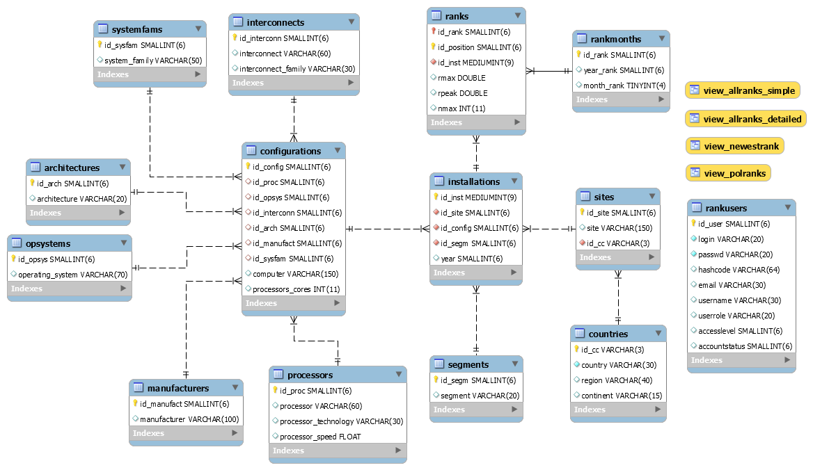

= README - RANK DATABASE

:githubdir: https://github.com/rperkow
:projectdir: /RankDatabase
:blobmasterdir: /blob/master
:sqldir: sql

## Wstęp

W ramach pierwszego etapu kursu Back-End Developer PWN należało wykonać dowolną bazę danych MySQL zgodnie z poniższą specyfikacją.

## Projekt nr 2: Implementacja relacyjnej bazy danych

. Zaprojektuj i zaimplementuj wybraną bazę danych tak aby składała się z minimum 5 tabel.
. Wprowadź przykładowe dane do powyższych tabel.
. Zastosuj wszystkie klauzule poznane w module: Bazy danych.
. Utwórz minimum 3 widoki ułatwiające wyświetlanie ważnych informacji.
. *Zastosuj trigger, który zautomatyzuje pewne operacje.

## Top 500 Rank (baza danych)

### Opis rankingu
W ramach projektu została wykonana baza danych zawierająca całą historię rankingu superkomputerów zamieszczanego na stronie https://www.top500.org/[TOP500.org] +

Kryterium decydującym o pozycji w rankingu jest parametr Rmax (mierzony obecnie w jednostkach TFlop/s, czyli operacjach zmiennoprzecinkowych na sekundę). 
Podaje on maksymalną wydajność dla pakietu obliczeniowego LINPACK, czyli biblioteki oprogramowania do rozwiązywania układów równań liniowych z wykorzystaniem operacji na wektorach i macierzach.
Ranking pojawia się dwa razy w roku, odpowiednio w miesiącach: czerwiec i listopad. Zawiera listę 500 najszybszych w danej chwili maszyn zainstalowanych 
w różnych ośrodkach naukowych, badawczych i przemysłowych na całym świecie. Publikowany jest nieprzerwanie od 1993 roku, a zatem w listopadzie 2017 roku pojawił się już po raz 50-ty.

### Ranking w plikach

Za każdym razem jest to oddzielny plik XLS (Excel). Dane są zgrupowane w postaci jednej dużej tabeli
zawierającej od 23 do 38 kolumn. Przed przystąpieniem do tworzenia bazy MySQL należało więc stworzyć
ujednoliconą tabelę zbiorczą tj. dla 50 rankingów po 500 rekordów każdy. W sumie 25 000 rekordów.
Zadanie okazało się niewdzięczne i pracochłonne, ze względu na dużą zmienność w liczbie kolum, ich nazewnictwie
i kolejności umiejscowienia w poszczególnych arkuszach.
Ostateczna tabela wynikowa składa się zatem z 29 kolumn i 25 000 rekordów. Rzecz jasna cechuje ją znaczna
redundancja informacji. 

### Normalizacja tabeli zbiorczej

W kolejnym etapie tabela podlega normalizacji, czyli podziałowi na mniejsze tabele
zgodnie z tzw. postaciami normalnymi tj. z uwzględnieniem zależności od kluczy potencjalnych i atrybutów niekluczowych.
Powstaje 13 tabel wynikowych powiązanych odpowiednimi identyfikatorami autoinkrementacji (klucze główne).
Zachowanie spójności powiązań pomiędzy identyfikatorami wymagało przeprowadzenia kilkuetapowego procesu
w ramach którego należało wykonać kilkanaście zapytań wprowadzających (insert into) dane do tabel cząstkowych
przy pomocy grupowania (group by), a następnie dodawania (alter) i aktualizacji (update) odpowiadających sobie
kolumn identyfikatorów. Tego żmudnego procesu podzielonego na kilka skryptów SQL nie załączono do plików projektowych.

### Skrypty tworzące bazę danych

W projekcie (w katalogu sql) znajdują się natomiast trzy następujące skrypty SQL:

link:{sqldir}/TOP500RANK-CREATE.sql[TOP500RANK-CREATE [8.73 KB]]::

Uruchomienie pierwszego skryptu (w aplikacji Workbench) skutkuje stworzeniem bazy danych "top500rank" i jej struktury 13-tu tabel i 4-ech widoków.
W dodatkowej czternastej tabeli umieszczono dane logowania do wykorzystania przez ewentualną przyszłą aplikację dostępową do bazy danych.

link:{sqldir}/TOP500RANK-DATA.sql[TOP500RANK-DATA [2.19 MB]]::

Wykonanie drugiego skryptu powoduje wypełnienie stworzonych właśnie tabel odpowiednimi danymi.

link:{sqldir}/TOP500RANK-QUERIES.sql[TOP500RANK-QUERIES [1.63 KB]]::

Trzeci skrypt zawiera przykładowe zapytania testowe, listujące zawartości poszczególnych tabel i widoków
oraz podające liczbę zwracanych przez nie rekordów wynikowych.

### Diagram ER

W pliku link:{sqldir}/ERD-TOP500RANK.png[ERD-TOP500RANK [95.7 KB]] umieszczono diagram bazy danych, prezentujący powiązania pomiędzy tabelami oraz stworzone widoki.

## Materiały

* "Bazy Danych MySQL" - ~250 slajdów z kursu PWN Back-End Developer.
* https://dev.mysql.com/doc/refman/5.7/en/[MySQL 5.7 Reference Manual] - instrukcja bazy danych MySQL.

## Narzędzia

* https://dev.mysql.com/downloads/mysql/[MySQL Community Server 5.7.20] - darmowy serwer relacyjnej bazy danych.
* https://downloads.mysql.com/archives/workbench/[MySQL Workbench 6.3.9] - narzędzie wizualne do tworzenia relacyjnych baz danych z użyciem języka SQL.

## Informacje dodatkowe

Projekt został zrealizowany na dzień **23 listopada 2017r.**
